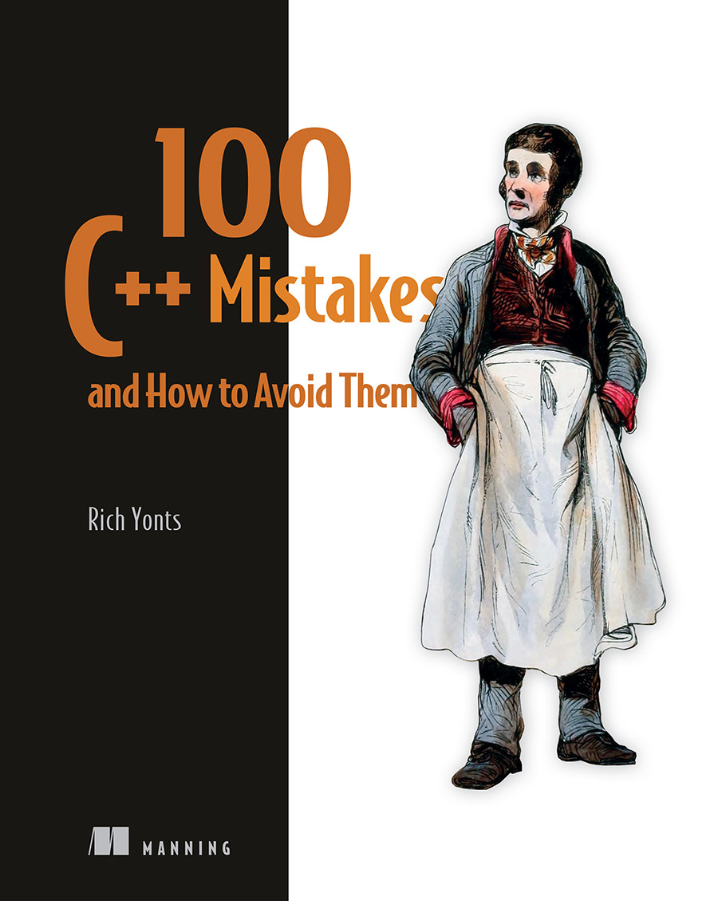

# C++编程避坑指南：100个常见错误及解决方案

*100 C++ Mistakes and How to Avoid Them*

* 作者：Rich Yonts
* 译者：陈晓伟
* 出版于: 2025年3月25日

> [!IMPORTANT]
> 翻译是译者用自己的思想，换一种语言，对原作者想法的重新阐释。鉴于我的学识所限，误解和错译在所难免。如果你能买到本书的原版，且有能力阅读英文，请直接去读原文。因为与之相较，我的译文可能根本不值得一读。
>
> — 云风，程序员修炼之道第2版译者

## 本书概述

**通过了解C++代码中的常见的错误，学习如何处理错误的、低效的和过时的编程模式。**

本书展示了在编写C++代码或调试遗留应用程序时，大概率会遇到的问题，以及解决这些问题所需的技术。

本书为各位提供了一些经验性见解和实用的技术，以提高各位读者的C++编程能力。作者Rich Yonts是最早使用C++的那批人，本书凝聚了他的很多经验，为C++开发者提供了很多提升代码质量的务实建议，其中很多示例来自于实际项目中。

**关于技术**

全球有超过十亿行的C++代码正在生产应用中运行，且每天都有98%的开发者在查找并修复这些代码中的错误。即使是任务关键型应用也存在错误、低效和可读性的问题。本书能助您在维护的代码中认识到这些问题，并在编写新代码时尽可能避免。

**关于本书**

本书介绍了从遗留应用到现代代码库（使用C++ 11及以上版本）改进C++代码的实用技术。作者Rich Yonts针对每个问题提供了一个具体的例子，并逐步指导读者如何改善代码的可读性、效果和性能。在此过程中，各位还将了解如何用现代C++替换旧式模式和习语。

**内容包括**

* 设计稳固的类型 
* 最小化资源分配/释放问题 
* 使用现代C++特性 
* 识别编译时与运行时问题的差异 
* 了解C语言的风格和惯用法 
* 有效地使用异常

本书中C++的标准从98到23都有，且重点在于调试和改进遗留代码。

## 作者简介

**Rich Yonts** 是 Teradata 的高级软件工程师，也是一位长期使用 C++、Java 和 Python 进行软件开发的工程师。他在 IBM 和 Sony 工作多年，曾担任过许多技术职务和领导职位。

## 本书相关

* Github翻译地址：https://github.com/xiaoweiChen/100-Cpp-Mistakes-and-How-to-Avoid-Them

* 译文的LaTeX 环境配置：https://www.cnblogs.com/1625--H/p/11524968.html

  * 禁用拼写检查：https://blog.csdn.net/weixin_39278265/article/details/87931348

  * 使用xelatex编译时需要添加`-shell-escape`和`-8bit`选项，例如：

    `xelatex -synctex=1 -interaction=nonstopmode -shell-escape -8bit "book".tex`

  * 为了内容中表格和目录索引能正常生成，至少需要连续编译两次

  * Latex中的中文字体([思源宋体](https://github.com/notofonts/noto-cjk/releases))和英文字体([Hack](https://github.com/source-foundry/Hack-windows-installer/releases/tag/v1.6.0))，需要安装后自行配置。如何配置请参考主book/css.tex顶部关于字体的信息。

* vscode中配置LaTeX：https://blog.csdn.net/Ruins_LEE/article/details/123555016

